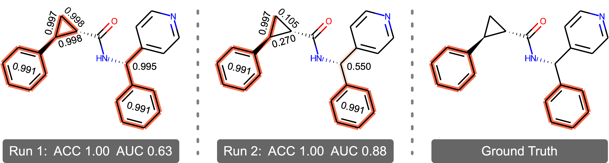

# Redundancy Undermines the Trustworthiness of Self-Interpretable GNNs

**💻 Official implementation of our ICML 2025 paper: Redundancy Undermines the Trustworthiness of Self-Interpretable GNNs**

> 🧠 Authors: [Wenxin Tai](https://scholar.google.com/citations?user=YyxocAIAAAAJ&hl=en), [Ting Zhong](https://scholar.google.com/citations?user=Mdr0XDkAAAAJ&hl=en), [Goce Trajcevski](https://scholar.google.com/citations?user=Avus2kcAAAAJ&hl=en), [Fan Zhou](https://scholar.google.com/citations?user=Ihj2Rw8AAAAJ&hl=en)  
> 📍 Institutions: University of Electronic Science and Technology of China & Iowa State University  
> 🔗 [Paper Link](https://arxiv.org/abs/...) (to be updated)  
> 🤖 This repository is maintained by [ICDM Lab](https://www.icdmlab.com/).

---

## 🧩 Overview

<p align="center">
  
</p>

**TL;DR: This work presents a systematic investigation into the trustworthiness of explanations generated by self-interpretable graph neural networks (GNNs), revealing that redundancy—caused by weak conciseness constraints—is the root cause of explanation inconsistency and its associated inaccuracy.**

We show that:
- Redundancy is difficult to eliminate via existing techniques
- A simple ensemble strategy can mitigate its detrimental effects

We validate our findings through extensive experiments across diverse datasets, model architectures, and self-interpretable GNN frameworks, establishing a **benchmark** for future research.

---

## 📦 Repository Structure

```bash
├── assets
├── configs         # configuration
├── criterion.py    # loss function
├── dataloader.py   # load data
├── dataset.py      # process data
├── datasets        # raw dataset
├── explainer.py    # explainer in self-interpretable GNNs (MLP)
├── main.py         # entry
├── model.py        # GNN backbone (GIN/GCN)
├── outputs         # checkpoints/logs
├── README.md
├── run.sh 
└── trainer.py      # train/valid/test
````

---

## ⚙️ Installation

We recommend creating a fresh Python environment (e.g., with conda):

```bash
conda create -n exgnn python=3.9
conda activate exgnn
pip install -r requirements.txt
```

---

## 📚 Datasets

We evaluate our method on a variety of datasets:

* Synthetic: BA-Shapes
* Molecular: MUTAG, 3MR, BENZENE

Datasets will be automatically processed on first run.

---

## 🏃‍♀️ Quick Start

### 1. Train a self-interpretable GNN 

```bash
python main.py --run_time 10 --dataset ba_2motifs --method gsat
```


### 2. Evaluate redundancy (SHD and AUC)

```bash
python main.py --run_time 10 --dataset ba_2motifs --method gsat --calculate_shd
```

```bash
python main.py --run_time 10 --dataset ba_2motifs --method gsat --test_by_sample_ensemble
```

---

## 📁 Pretrained Checkpoints
We provide **pretrained model checkpoints** and **training logs** for quick evaluation and reproduction.  

You can download them from the [Releases](https://github.com/ICDM-UESTC/TrustworthyExplanation/releases) tab. (to be updated)

To use the checkpoint, place it in the `outputs/checkpoints/` folder and run:
```bash
python main.py --run_time 10 --dataset ba_2motifs --method gsat --calculate_shd
python main.py --run_time 10 --dataset ba_2motifs --method gsat --test_by_sample_ensemble
```

Place **log files** (e.g., `events.out.tfevents.*`) in the `outputs/logs/` directory

You can then view them via TensorBoard:
```bash
tensorboard --logdir=./outputs/logs
```

---

## 📌 Citation

If you find this work useful, please cite us:

```bibtex
@inproceedings{tai2025redundancy,
  title     = {Redundancy Undermines the Trustworthiness of Self-Interpretable GNNs},
  author    = {Tai, Wenxin and Zhong, Ting and Trajcevski, Goce and Zhou, Fan},
  booktitle = {Proceedings of the 42nd International Conference on Machine Learning (ICML)},
  year      = {2025}
}
```

---

## 📬 Contact

If you have questions or suggestions, feel free to reach out via GitHub Issues or email: wxtai [AT] outlook [DOT] com